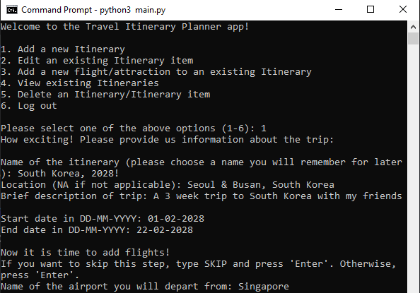
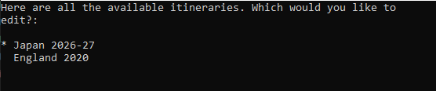
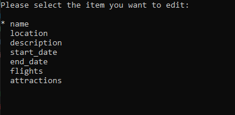
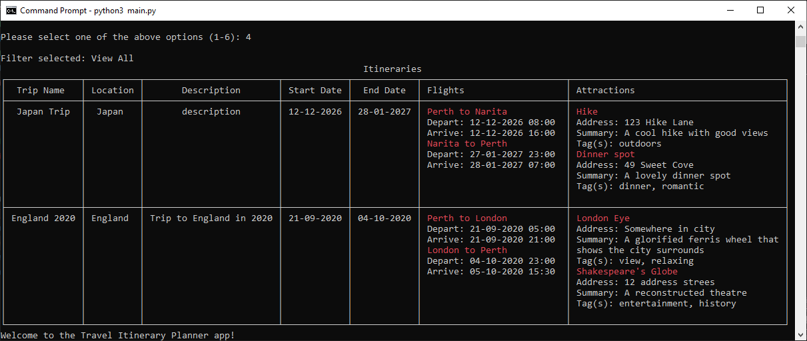

# Travel Itinerary Planner
This application lets you add, edit, view and delete itineraries from a CLI/terminal.
- Add and save an itinerary to an itineraries binary file that can be loaded and updated.
- Edit a saved itinerary item (e.g., name, location, flight departure date & time).
- Add multiple flights and/or attractions to one of the existing itineraries.
- View your itineraries (or a specific itinerary) in a formatted table.
- Delete a full itinerary, or just a flight or attraction from a specific itinerary (note: can only delete flights/attractions if there are more than 1 associated with that itinerary).

# Prerequisites
- Python 3.14
- pip (Python package installer)
- Command Line/Terminal (to run the application)
- rich 14.2.0
- pick 2.4.0

# Installing instructions
1. Clone the repository to your local machine
    ```bash
    git clone https://github.com/king04aman/All-In-One-Python-Projects.git
    ```
2. Change directory into the cloned repository
    ```bash
    cd All-In-One-Python-Projects/'Travel_Itinerary_Planner'/
    ``` 
3. Install the required libraries
    ```bash
    pip install -r requirements.txt
    ```
4. Run the program in Command Line or Terminal using
    ```bash
    python3 main.py
    ```

# Screenshot
### Welcome to the Travel Itinerary Planner!


### Choose what items to edit



### View your itineraries, formatted into a neat table!


### And other neat features listed at the top of this document :)

# Author
Gabrielle Allan

# Library credits

[pick library](https://pypi.org/project/pick/)

[rich library](https://github.com/Textualize/rich)